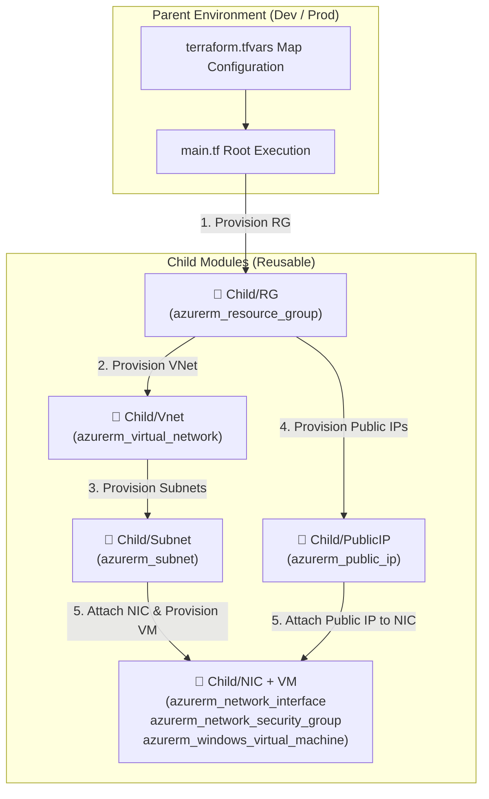

# 🚀 Azure Infrastructure as Code (IaC) with Terraform & GitHub Actions 🏗️

[](https://www.terraform.io/)
[](https://azure.microsoft.com/)
[](https://github.com/features/actions)
[](LICENSE)

> ⚡ **Enterprise-Grade Infrastructure Provisioning** using Terraform **Parent-Child (Modular)** Architecture for Microsoft Azure. Fully dynamic, environment-driven (`Dev` & `Prod`), and optimized for automated **GitHub CI/CD Pipelines**.

---

## 📋 Table of Contents 📌

- [✨ Key Features](#-key-features)
- [🏗️ Architecture Overview](#️-architecture-overview)
- [📁 Repository Structure](#-repository-structure)
- [🧩 Child Modules Breakdown](#-child-modules-breakdown)
- [🌍 Environments Configuration](#-environments-configuration)
- [🛠️ Prerequisites](#️-prerequisites)
- [🚀 Quick Start Guide](#-quick-start-guide)
  - [1. Clone Repository](#1-clone-repository)
  - [2. Authenticate to Azure](#2-authenticate-to-azure)
  - [3. Deploy Development Environment](#3-deploy-development-environment)
  - [4. Deploy Production Environment](#4-deploy-production-environment)
- [🔄 CI/CD Pipeline Integration](#-cicd-pipeline-integration)
- [🔐 Security & Best Practices](#-security--best-practices)
- [🤝 Contributing](#-contributing)
- [📜 License](#-license)

---

## ✨ Key Features 🌟

* 🧩 **Parent-Child Modular Architecture**: Clean separation between reusable resource definitions (`Child/`) and environment-specific implementations (`Parent/`).
* 🔄 **Dynamic Resource Provisioning**: Uses Terraform `for_each` maps to dynamically create multiple Resource Groups, Virtual Networks, Subnets, Public IPs, and Virtual Machines without duplicating code.
* 🌐 **Multi-Environment Support**: Isolated state and configuration management for `Dev` and `Prod` environments.
* 🛡️ **Network & Access Security**: Includes automated NSG (Network Security Group) creation with targeted inbound security rules (e.g., RDP Port 3389).
* 💻 **Windows VM Infrastructure**: Standardized Windows Server VM provisioning with dedicated Network Interfaces (NICs) and Public IPs.
* ⚙️ **CI/CD Pipeline Ready**: Easily integratable into GitHub Actions workflows for continuous integration and automated deployments.

---

## 🏗️ Architecture Overview 📐



---

## 📁 Repository Structure 🗂️

```text
.
├── 📂 Child/                       # Reusable Core Terraform Modules
│   ├── 📂 NIC + VM/               # Network Interface, NSG & Windows VM module
│   │   ├── 📄 data.tf             # Subnet & Public IP data lookups
│   │   ├── 📄 main.tf             # NSG, NIC, NSG Association & Windows VM resources
│   │   └── 📄 variables.tf        # Input variable schemas for VM module
│   ├── 📂 PublicIP/               # Azure Public IP module
│   │   ├── 📄 main.tf
│   │   └── 📄 variables.tf
│   ├── 📂 RG/                     # Azure Resource Group module
│   │   ├── 📄 main.tf
│   │   └── 📄 variables.tf
│   ├── 📂 Subnet/                 # Azure Subnet module
│   │   ├── 📄 main.tf
│   │   └── 📄 variables.tf
│   └── 📂 Vnet/                   # Azure Virtual Network module
│       ├── 📄 main.tf
│       └── 📄 variable.tf
│
├── 📂 Parent/                      # Environment-Specific Deployments
│   ├── 📂 Dev/                    # Development Environment
│   │   ├── 📄 main.tf             # Root module invocations with dependencies
│   │   ├── 📄 providers.tf        # AzRM Provider setup & Terraform requirements
│   │   ├── 📄 terraform.tfvars    # Dev Environment parameter values
│   │   └── 📄 variable.tf         # Root input variable declarations
│   └── 📂 Prod/                   # Production Environment
│       ├── 📄 main.tf             # Root module invocations with dependencies
│       ├── 📄 providers.tf        # AzRM Provider setup & Terraform requirements
│       ├── 📄 terraform.tfvars    # Prod Environment parameter values
│       └── 📄 variable.tf         # Root input variable declarations
│
├── 📄 .gitignore                  # Git ignore rules for Terraform states & local keys
└── 📄 README.md                   # Project Documentation
```

---

## 🧩 Child Modules Breakdown 📦

| Module Path | Azure Resources Managed | Description |
| :--- | :--- | :--- |
| `Child/RG` | `azurerm_resource_group` | Manages Resource Groups across targeted Azure regions. |
| `Child/Vnet` | `azurerm_virtual_network` | Provisions Virtual Networks with configurable CIDR address blocks. |
| `Child/Subnet` | `azurerm_subnet` | Creates subnets mapped to specified Virtual Networks. |
| `Child/PublicIP` | `azurerm_public_ip` | Allocates Static/Dynamic Public IPs for virtual instances. |
| `Child/NIC + VM` | `azurerm_network_interface`<br>`azurerm_network_security_group`<br>`azurerm_windows_virtual_machine` | Provisions NICs, Network Security Groups (NSGs) with default RDP access, and Windows Server Virtual Machines. |

---

## 🌍 Environments Configuration ⚙️

The project maintains clean segregation between target environments using dedicated parameter files (`terraform.tfvars`):

### 🧪 Development (`Parent/Dev`)
* **Resource Group**: `rg-dushyant`
* **Region**: `centralindia`
* **Network**: `vnet-Jio` (`10.0.0.0/16`)
* **Subnets**: `frontend-subnet` (`10.0.1.0/24`), `backend-subnet` (`10.0.2.0/24`)
* **Virtual Machines**: 2 x Windows Server 2016 (`frontend-vm`, `backend-vm`)

### 🚀 Production (`Parent/Prod`)
* Configured with production-grade naming conventions and isolated credentials.

---

## 🛠️ Prerequisites 🧰

Before running the deployment, ensure you have the following CLI tools installed and configured:

* 🟪 [Terraform CLI](https://developer.hashicorp.com/terraform/downloads) (`v1.5.0` or higher)
* 🔷 [Azure CLI](https://learn.microsoft.com/en-us/cli/azure/install-azure-cli) (`v2.40.0` or higher)
* 🐙 [Git CLI](https://git-scm.com/)

---

## 🚀 Quick Start Guide ⚡

### 1. Clone Repository 📥

```bash
git clone https://github.com/Shibayan97/b18-g31-github-pipeline.git
cd b18-g31-github-pipeline
```

### 2. Authenticate to Azure 🔐

Log in to your Azure account and select your target Subscription ID:

```bash
az login
az account set --subscription "YOUR_AZURE_SUBSCRIPTION_ID"
```

### 3. Deploy Development Environment 🛠️

Navigate to the `Dev` parent directory and execute the standard Terraform workflow:

```bash
cd Parent/Dev

# 1. Initialize Terraform working directory & download providers
terraform init

# 2. Generate and inspect an execution plan
terraform plan

# 3. Apply the execution plan to provision Azure infrastructure
terraform apply -auto-approve
```

### 4. Deploy Production Environment 🏭

Navigate to the `Prod` parent directory:

```bash
cd ../Prod

terraform init
terraform plan
terraform apply -auto-approve
```

---

## 🔄 CI/CD Pipeline Integration 🤖

This repository is optimized for **GitHub Actions CI/CD workflows**. Recommended workflow sequence:

```yaml
name: 'Terraform CI/CD Pipeline'

on:
  push:
    branches: [ "main" ]
  pull_request:
    branches: [ "main" ]

jobs:
  terraform:
    name: 'Terraform Plan & Apply'
    runs-on: ubuntu-latest

    steps:
    - name: Checkout Code
      uses: actions/checkout@v3

    - name: Setup Terraform
      uses: hashicorp/setup-terraform@v2

    - name: Azure Login
      uses: azure/login@v1
      with:
        creds: ${{ secrets.AZURE_CREDENTIALS }}

    - name: Terraform Init (Dev)
      run: terraform -chdir=Parent/Dev init

    - name: Terraform Plan (Dev)
      run: terraform -chdir=Parent/Dev plan

    - name: Terraform Apply (Dev)
      if: github.ref == 'refs/heads/main' && github.event_name == 'push'
      run: terraform -chdir=Parent/Dev apply -auto-approve
```

---

## 🔐 Security & Best Practices 🛡️

1. **State Storage**: Store production `.tfstate` files remotely using Azure Storage Account backends with state locking enabled (e.g., Azure Blob Storage).
2. **Secrets Management**: Never commit plain-text passwords in `terraform.tfvars`. Use **Azure Key Vault** or **GitHub Actions Encrypted Secrets** for `admin_password`.
3. **Network Access**: Restrict RDP port `3389` in NSG rules to specific trusted corporate IP ranges (`source_address_prefix`) rather than `*`.

---

## 🤝 Contributing 💡

Contributions, issues, and feature requests are welcome!  
Feel free to check out the [issues page](../../issues).

1. Fork the Project
2. Create your Feature Branch (`git checkout -b feature/AmazingFeature`)
3. Commit your Changes (`git commit -m 'Add some AmazingFeature'`)
4. Push to the Branch (`git push origin feature/AmazingFeature`)
5. Open a Pull Request

---

## 📜 License 📄

Distributed under the MIT License. See `LICENSE` for more information.

---

<p align="center">
  Made with ❤️ for <b>DevOps Batch 18</b> | Powered by Terraform & Azure ☁️
</p>
